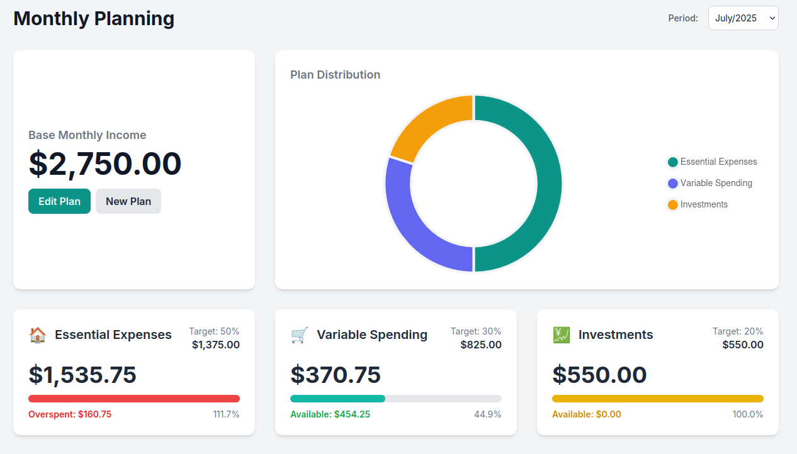

# Especificação da Funcionalidade: Planeamento Financeiro (Orçamento por Grupos)
## Visão Geral e Motivação
### Resumo
Esta funcionalidade permite aos utilizadores criar um Plano Financeiro mensal baseado na sua renda. O utilizador pode definir "Grupos de Orçamento" (ex: "Despesas Essenciais", "Lazer", "Investimentos"), atribuir uma percentagem da sua renda a cada grupo e, o mais importante, associar as suas categorias de despesa existentes a estes grupos.

A aplicação irá então comparar, em tempo real, os gastos reais de cada grupo com a meta definida, mostrando o progresso e ajudando o utilizador a manter-se dentro do seu orçamento.

*Rascunho da interface*

### Motivação
A gestão financeira eficaz vai para além do simples registo de transações; ela exige planeamento. Inspirado em métodos populares como o 50/30/20, este módulo dá aos utilizadores o poder de:

- Definir Intenções: Decidir para onde o seu dinheiro deve ir antes de o gastar.
- Obter Clareza: Entender se os seus padrões de gastos estão alinhados com os seus objetivos financeiros.
- Tomar Ações Corretivas: Identificar rapidamente áreas onde estão a gastar a mais e fazer ajustes.

## Conceitos Fundamentais
Plano Financeiro (FinancialPlan): A entidade principal. Um utilizador pode ter um ou mais planos. Cada plano contém:
- Nome: Ex: "Orçamento Mensal 2025".
- Renda Base Mensal: O valor total de rendimentos que serve de base para todos os cálculos percentuais.

Grupo de Orçamento (BudgetGroup): A espinha dorsal do plano. Cada grupo representa uma "fatia" do orçamento.
- Nome: Ex: "Despesas Essenciais", "Estilo de Vida", "Metas Financeiras".
- Percentagem Alvo: A percentagem da Renda Base que o utilizador pretende transacionar neste grupo (ex: 50%).
- Categorias Associadas: Uma lista de categorias de despesa (Category) que pertencem a este grupo. Esta é a ligação entre o planeamento e as transações reais.

## Fluxo do Utilizador
### Criação de um Novo Plano (Wizard)
- Passo 1: Iniciar: O utilizador clica em "Criar Novo Plano Financeiro".
- Passo 2: Renda: Insere a sua Renda Base Mensal (ex: $ 2.750,00).
- Passo 3: Modelo (Template): O sistema oferece modelos pré-definidos para facilitar:
  - Estratégia 50/30/20: (50% Essenciais, 30% Variáveis, 20% Investimentos)
  - Estratégia 30/30/40: (30% Essenciais, 30% Variáveis, 40% Investimentos)
  - Personalizado: O utilizador cria os seus próprios grupos e percentagens.
- Passo 4: Associar Categorias: Para cada Grupo de Orçamento criado (ex: "Despesas Essenciais"), o utilizador vê uma lista de todas as suas categorias de transações e seleciona as que pertencem a esse grupo (ex: "Aluguel", "Contas de Casa", "Supermercado"). Esta é a etapa mais crucial.

### Visualização e Acompanhamento (Dashboard)
Uma nova secção na UI irá mostrar o plano ativo para o mês corrente. Para cada Grupo de Orçamento, o utilizador verá:

- Nome do Grupo: "Despesas Essenciais"
- Meta: 50% ($ 1.375,00)
- Gasto Atual: A soma de todas as transações do mês cujas categorias estão associadas a este grupo (ex: $950,00).
- Progresso: Uma barra de progresso visual que mostra (Gasto Atual / Meta).
  - Se for um grupo relacionado a receita ou investimentos: A cor da barra muda consoante o progresso (vermelho -> amarelo -> verde).
  - Se for um grupo relacionado a despesas: A cor da barra muda consoante o progresso (verde -> amarelo -> vermelho).
- Disponível/Excedido: A diferença entre a meta e o gasto atual (ex: "Disponível: \$425,00", "Ainda falta: $425,00).

## Especificação Técnica e Adaptações no App
### Alterações no Modelo de Dados
Serão necessárias três novas tabelas na base de dados:

financial_plan
- id (PK)
- name (VARCHAR)
- base_income (NUMERIC)

budget_group
- id (PK)
- name (VARCHAR)
- target_percentage (INTEGER)
- plan_id (FK para financial_plan.id)

budget_group_categories (Tabela de Junção para a relação Many-to-Many)
- budget_group_id (FK para budget_group.id)
- category_id (FK para a sua tabela category.id existente)

### Lógica na Camada de Serviço (Service Layer)
FinancialPlanningService: Um novo serviço será criado para gerir toda a lógica.
- createPlan(name, income, groups): Método para criar o plano e os seus grupos.
- assignCategoryToGroup(groupId, categoryId): Método para criar a associação na tabela de junção.
- getPlanStatus(planId, month, year): Este será o método principal. Ele irá:
  - Obter o plano e os seus grupos.
  - Para cada grupo, obter a lista de IDs de categorias associadas.
  - Chamar o WalletTransactionRepository com uma consulta como: SELECT SUM(amount) FROM wallet_transaction WHERE category_id IN (...) AND strftime('%Y-%m', date) = 'YYYY-MM'.
  - Calcular o progresso e retornar um objeto com todos os dados para a UI.

### Melhorias e Ideias para Evolução
Esta funcionalidade tem um enorme potencial de crescimento. Como possível evolução, consideramos as seguintes melhorias:
- Análise de "Sobra/Falta": No final do mês, se um grupo não atingiu a meta (ex: sobrou dinheiro em "Lazer"), permitir que o utilizador "transfira" essa sobra para outro grupo (como "Investimentos") ou a "transporte" para o próximo mês.
- Alertas e Notificações: Notificar o utilizador quando ele atingir 80% ou 100% da meta de um grupo.
- Planeamento para Despesas Não-Mensais: Criar um tipo de grupo especial, como "Fundo de Provisionamento", onde o utilizador pode alocar uma percentagem mensal para despesas anuais (ex: IUC, seguros), e o saldo acumula de mês para mês.
- Sugestões Inteligentes: Após alguns meses de utilização, a aplicação poderia analisar os dados e sugerir: "Notamos que a sua categoria 'Restaurantes' está consistentemente a exceder o orçamento. Gostaria de lhe atribuir uma meta própria?"
- Gráficos Históricos: Mostrar a evolução dos gastos por grupo ao longo do tempo.

## Checklist de Implementação
### Fase 1: Backend (Estrutura de Dados e Lógica de Negócio)
Modelagem de dados:
- [X] Atualizar o modelo de dados para incluir as novas tabelas financial_plan, budget_group e budget_group_categories.

Migração da Base de Dados (Flyway):
- [X] Criar um novo script de migração SQL (V00X__create_financial_plan_tables.sql).
- [X] Definir a tabela financial_plan com as colunas id, name, base_income.
- [X] Definir a tabela budget_group com as colunas id, name, target_percentage e plan_id (chave estrangeira para financial_plan).
- [X] Definir a tabela de junção budget_group_categories com as colunas budget_group_id e category_id.

Entidades JPA:
- [X] Criar a classe de entidade FinancialPlan.java.
- [X] Criar a classe de entidade BudgetGroup.java.
- [X] Implementar a relação @ManyToMany em BudgetGroup para a entidade Category existente, usando a tabela de junção.

Repositórios (Spring Data JPA):
- [X] Criar a interface FinancialPlanRepository.
- [X] Criar a interface BudgetGroupRepository.
- [X] Adicionar uma consulta ao WalletTransactionRepository para somar os montantes por uma lista de IDs de categoria e um intervalo de datas (mês/ano).

Camada de Serviço (FinancialPlanningService):
- [X] Criar a nova classe de serviço FinancialPlanningService.java.
- [X] Implementar o método createPlan(name, income, groups) para criar um novo plano e os seus grupos.
- [X] Implementar o método updatePlan(...) para editar um plano existente.
- [X] Implementar o método assignCategoriesToGroup(groupId, categoryIds) para gerir as associações.
- [X] Implementar o método principal getPlanStatus(planId, YearMonth period) que calcula os gastos atuais para cada grupo e retorna os dados para a UI.

Testes Unitários (Backend):
- [X] Criar a classe FinancialPlanningServiceTest.java.
- [X] Escrever testes para validar a criação de planos.
- [X] Escrever testes para validar a edição de planos.
- [X] Escrever testes para a lógica de cálculo do método getPlanStatus, simulando diferentes cenários de transações.
- [X] Testar os casos de erro (ex: percentagens que não somam 100%, dados inválidos).

### Fase 2: Frontend (Interface do Utilizador em JavaFX)
Navegação Principal:
- [X] Modificar ícone da barra lateral de Goal para Goals & Plans
- [X] Separar Goals e Plans em duas tabs diferentes.

Tela Principal de Planeamento:
- [X] Criar o ficheiro planning.fxml seguindo o esboço visual.
- [X] Criar o controller PlanningController.java.
- [X] Implementar o ComboBox para a seleção do período (mês/ano).
- [X] Implementar o card de "Renda Base Mensal".
- [X] Implementar o gráfico de anel (Doughnut Chart) para a "Distribuição do Plano".
- [X] Criar um contentor (ex: GridPane ou FlowPane) para os cards dos grupos de orçamento.

Componente Reutilizável (Card de Grupo de Orçamento):
- [X] Criar um FXML separado (budget_group_card.fxml) para um único card.
- [X] Criar o seu respetivo controller (BudgetGroupCardController.java).
- [X] Implementar a lógica para preencher os dados do card (título, metas, valor gasto, barra de progresso, etc.).
- [X] Implementar a lógica de cores dinâmicas para a barra de progresso e o texto de estado.

Lógica do Controller Principal (PlanningController):
- [X] Injetar o FinancialPlanningService.
- [X] No método initialize, carregar os dados do plano para o mês atual.
- [X] Criar um método updateView(YearMonth period) que:
  - Chama o financialPlanningService.getPlanStatus(). 
  - Atualiza o gráfico de anel. 
  - Limpa e recria dinamicamente os cards dos grupos de orçamento no contentor.
- [X] Adicionar um listener ao ComboBox de período para chamar updateView.

Assistente de Criação/Edição de Planos (Diálogos):
- [X] Criar o FXML e o controller para o diálogo de "Novo/Editar Plano".
- [X] Implementar a interface para definir o nome do plano e a renda base.
- [X] Implementar a interface para adicionar/editar/remover grupos e as suas percentagens, incluindo os modelos (50/30/20, etc.).
- [X] Implementar a interface para associar categorias a cada grupo (ex: CheckListView ou duas ListViews com botões de transferência).

### Fase 3: Integração e Finalização
Constantes e Estilos:
- [X] Adicionar os caminhos para os novos ficheiros FXML no ficheiro Constants.java.
- [X] Criar um novo ficheiro CSS (planning.css) para estilizar os novos componentes, garantindo a consistência com o tema da aplicação.

Testes End-to-End:
- [X] Testar o fluxo completo: criar um plano, associar categorias, adicionar transações nessas categorias e verificar se o dashboard de planeamento reflete os dados corretamente.
- [X] Testar a edição de um plano e verificar se os cálculos são atualizados.
- [X] Testar a navegação entre diferentes meses.