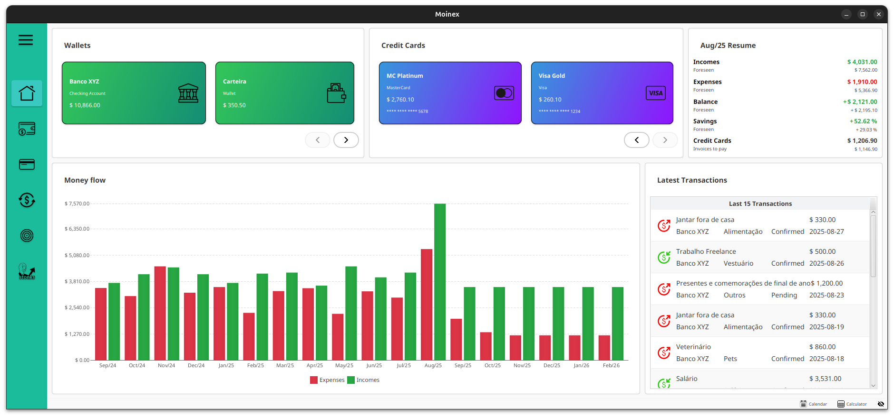

<h1 align="center">
<br>

<br>
</h1>

<p align="center">


</p>

MOINEX é uma aplicação de gestão financeira pessoal que permite aos utilizadores registar, visualizar e acompanhar as
suas transações financeiras. A aplicação possibilita a categorização de receitas e despesas, o cálculo de balanços
mensais e a exibição de gráficos, proporcionando uma visão clara da saúde financeira de forma intuitiva.



## Funcionalidades Principais

- **Gestão de Múltiplas Carteiras:** Controle contas correntes, poupanças, investimentos e muito mais.
- **Registo de Transações:** Adicione receitas e despesas com categorização detalhada.
- **Metas de Poupança:** Crie objetivos financeiros e acompanhe o seu progresso.
- **Relatórios e Gráficos:** Visualize a sua saúde financeira com gráficos intuitivos de balanço, despesas por categoria,
  etc.
- **Privacidade:** Todos os seus dados são armazenados localmente no seu computador.
- **Software Livre:** Código aberto e transparente.

## Tecnologias Utilizadas

- **Backend:** Java 21, Spring Boot, Spring Data JPA
- **Interface Gráfica:** JavaFX
- **Base de Dados:** SQLite
- **Testes:** JUnit, Mockito, H2

## Compatibilidade

A aplicação e o script de instalação foram desenvolvidos e testados para ambientes **Linux**.

A aplicação Java (.jar) em si é multiplataforma e pode rodar em macOS e Windows, mas o script de
instalação atual ([scripts/install.sh](https://github.com/luk3rr/MOINEX/blob/main/scripts/install.sh)) é específico para Linux e não funcionará nesses sistemas.

## Instalação

A instalação é feita através de um script interativo que lhe permite escolher a versão do Moinex que deseja instalar.

### Pré-requisitos

Antes de começar, certifique-se de que tem as seguintes ferramentas instaladas:

- Git
- Java 21
- Maven

### Passos de Instalação

Abra o seu terminal e clone o projeto para a sua máquina.

```bash
git clone https://github.com/luk3rr/MOINEX.git
cd MOINEX
```

Execute o script de instalação:

```bash
sh scripts/install.sh
```

Durante a execução do script, você terá a opção de selecionar qual versão do app será instalada.
Use o teclado para digitar o número da versão que deseja instalar e pressione Enter.

- **Versão de Desenvolvimento:** Escolha a opção **main** para instalar a versão mais recente, que pode conter novas
  funcionalidades ainda em teste.
- **Versões Estáveis:** Recomenda-se escolher a última versão estável para uma melhor experiência.

O script irá então compilar a aplicação, criar os diretórios necessários e instalar o Moinex no seu sistema.

- **Arquivos da Aplicação:** $HOME/.moinex/
- **Base de Dados:** $HOME/.moinex/data/
- **Arquivos de Log:** $HOME/.local/state/moinex

## Desinstalação

Para remover completamente o Moinex e todos os seus dados do seu sistema, execute o script de desinstalação:

```bash
sh scripts/uninstall.sh
```

:warning: Este comando irá apagar permanentemente a sua base de dados com todas as suas transações. Faça um backup do
diretório $HOME/.moinex/data/ se desejar restaurar os seus dados no futuro.