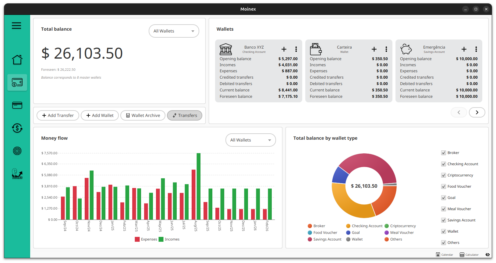
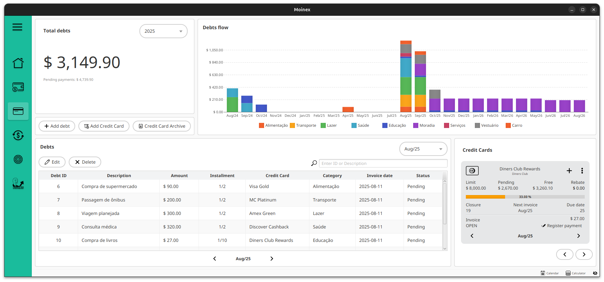
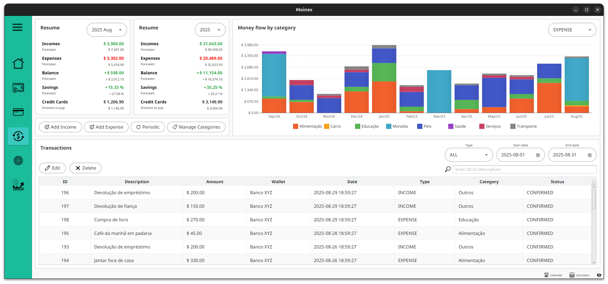
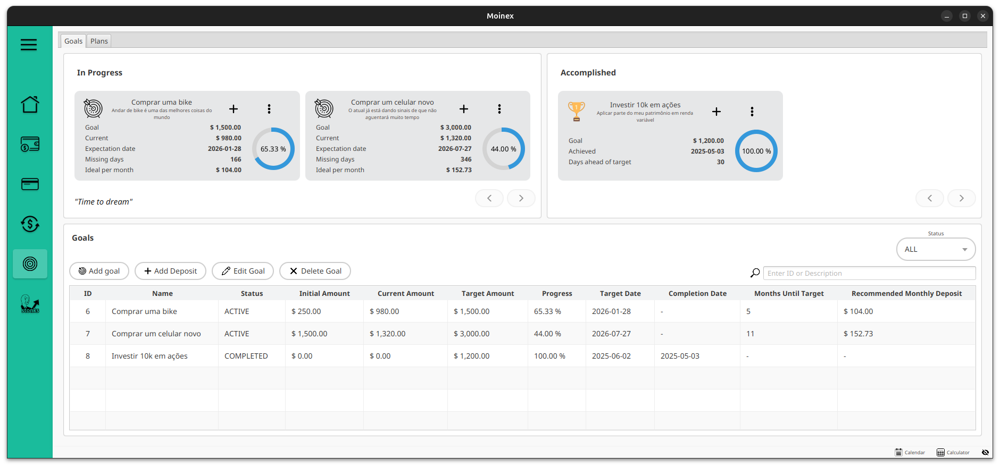

<h1 align="center">
<br>

<br>
</h1>

<p align="center">


</p>

MOINEX é uma aplicação de gestão financeira pessoal que permite aos utilizadores registar, visualizar e acompanhar as
suas transações financeiras. A aplicação possibilita a categorização de receitas e despesas, o cálculo de balanços
mensais e a exibição de gráficos, proporcionando uma visão clara da saúde financeira de forma intuitiva.


### Mais Capturas de Tela

<details>
<summary>Clique para ver mais imagens da aplicação</summary>

#### Carteiras


#### Cartão de Crédito


#### Gestão de Transações


#### Metas 


#### Investimentos


</details>

## Funcionalidades Principais

- **Gestão de Múltiplas Carteiras:** Controle contas correntes, poupanças, investimentos e muito mais.
- **Registo de Transações:** Adicione receitas e despesas com categorização detalhada.
- **Metas de Poupança:** Crie objetivos financeiros e acompanhe o seu progresso.
- **Relatórios e Gráficos:** Visualize a sua saúde financeira com gráficos intuitivos de balanço, despesas por categoria,
  etc.
- **Privacidade:** Todos os seus dados são armazenados localmente no seu computador.
- **Software Livre:** Código aberto e transparente.

## Tecnologias Utilizadas

- **Backend:** Java 21, Spring Boot, Spring Data JPA
- **Interface Gráfica:** JavaFX
- **Base de Dados:** SQLite
- **Testes:** JUnit, Mockito, H2

## Compatibilidade

O Moinex está disponível para **Linux** e **Windows**.

## Instalação

### Windows 

1. Acesse a [página de releases](https://github.com/luk3rr/MOINEX/releases/latest)
2. Baixe o arquivo `Moinex-X.X.X.exe` da última versão
3. Execute o instalador
4. Siga o assistente de instalação
5. Pronto! Encontre o Moinex no Menu Iniciar

**Localização dos arquivos:**
- Aplicação: `%USERPROFILE%\.moinex\`
- Base de dados: `%USERPROFILE%\.moinex\data\`
- Logs: `%LOCALAPPDATA%\moinex\state`

### Linux

**Instalação via script interativo**

#### Pré-requisitos

Certifique-se de ter instalado:
- Git
- Java 21
- Maven
- Python 3 (com pip)

#### Passos

1. Clone o repositório:
```bash
git clone https://github.com/luk3rr/MOINEX.git
cd MOINEX
```

2. Execute o script de instalação:
```bash
sh scripts/install.sh
```

3. Escolha a versão desejada:
   - **main** - versão de desenvolvimento (pode ser instável)
   - **Versões estáveis** - recomendadas para uso diário

**Localização dos arquivos:**
- Aplicação: `$HOME/.moinex/`
- Base de dados: `$HOME/.moinex/data/`
- Logs: `$HOME/.local/state/moinex`

## Desinstalação

### Windows

1. Abra **Configurações** do Windows
2. Vá em **Aplicativos** → **Aplicativos instalados**
3. Procure por **Moinex**
4. Clique em **Desinstalar**
5. Siga o assistente de desinstalação

> [!WARNING]
> A desinstalação remove a aplicação, mas seus dados em `%USERPROFILE%\.moinex\` são preservados. Para remover completamente, delete manualmente esta pasta após desinstalar.

### Linux

Execute o script de desinstalação:

```bash
sh scripts/uninstall.sh
```

> [!WARNING]
> Este comando irá apagar permanentemente a sua base de dados com todas as suas transações. Faça um backup do diretório `$HOME/.moinex/data/` se desejar restaurar os seus dados no futuro.